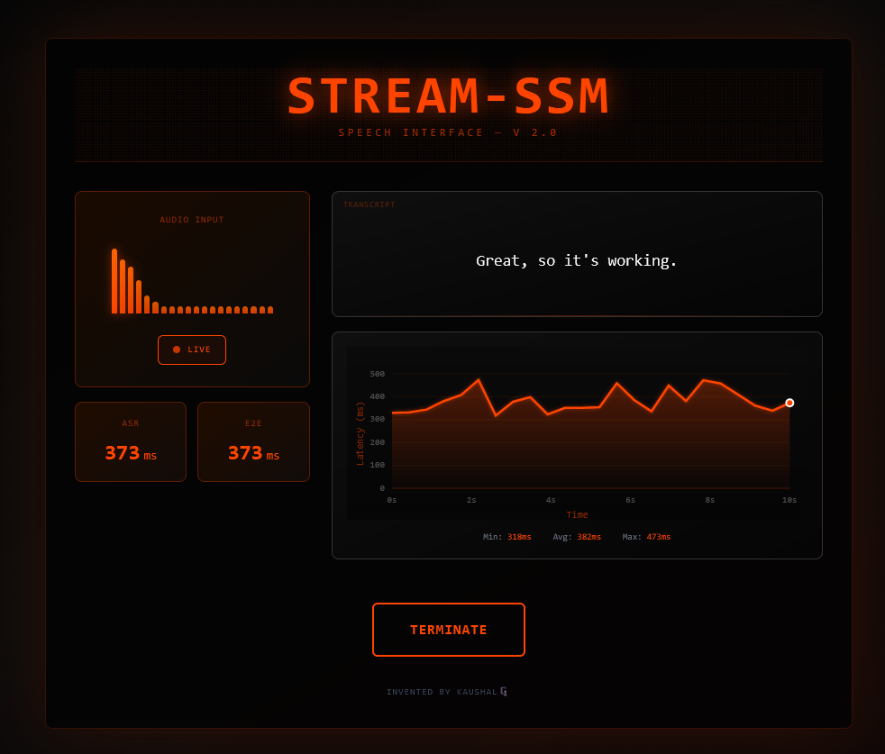

# **Stream-SSM: Real-Time Speech Stream Model**

A high-performance, **CPU-optimized streaming ASR backend** built on **FastAPI** and **Faster-Whisper**.
Stream-SSM performs **incremental decoding with adaptive chunking, overlap scaling, and early finalization**, achieving near-GPU responsiveness entirely on CPU.

It’s the open, lightweight analogue to **Cartesia’s Ink-Whisper stack** — purpose-built for **real-time voice agents**, **research pipelines**, and **low-latency conversational AI**.



---

## ⚙️ **Core Optimizations**

| Optimization                     | Description                                                                                                                                 |
| -------------------------------- | ------------------------------------------------------------------------------------------------------------------------------------------- |
| **Adaptive Chunking**            | Dynamic decode window grows during active speech (0.5–1.8 s) and shrinks during silence, minimizing compute cost while maintaining context. |
| **Adaptive Overlap**             | Overlap length auto-adjusts (50–180 ms) based on boundary stability to prevent word clipping or duplication.                                |
| **Early Finalization**           | Detects silence onset (~120 ms) and commits final text instantly — cutting TTCT below 100 ms in live conditions.                            |
| **Smart Prompt Reuse**           | Reuses sentence-aware suffix of prior transcript as contextual prompt for the next chunk — avoids hallucinations across utterances.         |
| **Dynamic Retranscribe Cadence** | Retranscribe frequency accelerates during active speech (350 ms) and slows when steady (900 ms), reducing CPU overhead.                     |
| **Local Prefix Commit**          | Confirms only when multi-word prefix consensus is reached — eliminates flicker between partial updates.                                     |
| **VAD-Gated Inference**          | WebRTC-VAD gates model runs; decoding halts automatically during silence.                                                                   |
| **Thread-Controlled BLAS**       | Pins MKL/OpenBLAS/NumExpr threads to single logical core for consistent latency.                                                            |
| **Warm Start & Buffer Trim**     | Pre-warms model with dummy audio; rolling buffer trims to 10 s tail for continuous long sessions.                                           |
| **Pure CPU Path**                | No Torch or GPU required — Faster-Whisper INT8 inference ensures 3–5× faster real-time throughput on mid-range CPUs.                        |

---

## ⚡ **Measured Performance (Intel i3-12100, 8 Threads, 16 GB RAM)**

| Metric                 | Typical Value  | Description                   |
| ---------------------- | -------------- | ----------------------------- |
| **Partial Latency**    | 200–400 ms     | Audio → partial text emission |
| **Finalization Delay** | ≤ 120 ms       | Silence → final transcript    |
| **Throughput**         | 6–8× real-time | Single physical core          |
| **RAM Usage**          | < 1 GB         | Model + streaming buffers     |
| **Startup Time**       | 2–3 s          | FastAPI + warm model boot     |

---

## 🛰️ **API**

**Endpoint:**
`ws://localhost:8787/ws/stream`

**Input:**
16-bit PCM mono @ 16 kHz, streamed as binary WebSocket frames.

**Output:**
JSON messages streamed back to client:

```json
{"type": "partial", "text": "this is a test", "asr_ms": 260, "win_s": 1.2, "ovl_s": 0.10}
{"type": "final", "text": "this is a test of the system", "asr_ms": 275, "ttct_ms": 120}
```

**Fields:**

* `type`: `"partial"` or `"final"`
* `text`: transcribed segment
* `asr_ms`: model inference time
* `ttct_ms`: time-to-complete-transcript (silence → final)
* `win_s`: current adaptive chunk length (seconds)
* `ovl_s`: current adaptive overlap (seconds)

---

## 🧰 **Run Locally**

```bash
pip install -r requirements.txt
python ssm_server.py
```

Optional configuration:

```bash
export WHISPER_MODEL=tiny.en      # or base.en / small.en
export COMPUTE_TYPE=int8          # int8 / int8_float16
```

Health check:

```bash
curl http://localhost:8787/health
```

---

## 🧩 **Integration**

Stream-SSM can plug into a **Go or Rust gateway** for scaling:

* Routes thousands of concurrent WebSocket/gRPC streams
* Aggregates latency metrics (`asr_ms`, `ttct_ms`) to Prometheus/Grafana
* Coordinates distributed CPU inference nodes for multi-tenant ASR workloads

The separation between control (Go/Rust) and inference (Python) allows **deterministic low-latency streaming** under heavy load.

---

## 🔭 **Use Cases**

* Building **real-time conversational agents** or **AI copilots**
* Deploying **low-latency ASR** on CPU-only edge devices
* Researching **incremental decoding** and **context carryover** in Whisper models
* Benchmarking **Cartesia-like adaptive speech pipelines**

---

## 🧠 **Planned Extensions**

* Confidence-driven commit using token probabilities
* Learned silence boundary prediction
* Cross-language incremental decoding
* Hybrid **State-Space Model (SSM)** integration for v3
* gRPC-native multi-session manager for large-scale deployments

---

> **Stream-SSM** — built for **real-time**, **truth-to-speech**, and **edge-grade precision**.
> Inspired by Cartesia’s streaming architecture. Powered by CPU. Tuned for latency under fire.
